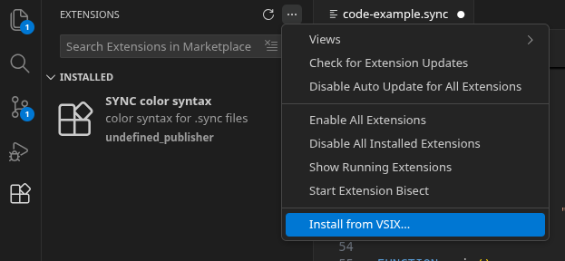

# VSCODE Installation Guide

## 1) Download custom extension**

Download the file [sync-color-syntax.zip](./sync-color-syntax.zip), it contains the custom extension files that you can also browser in the [sync-color-syntax](./sync-color-syntax/) folder.

## 2) Install the extension in VS Code

- Open **VS Code** and click on the **extensions** panel.
- In the panel go to the three dots (`...`) and click on `install from VSIX`.
- Select the `sync-color-syntax-0.0.1.vsix` in the extension folder.

If all went well, you are now ready to go 😎
